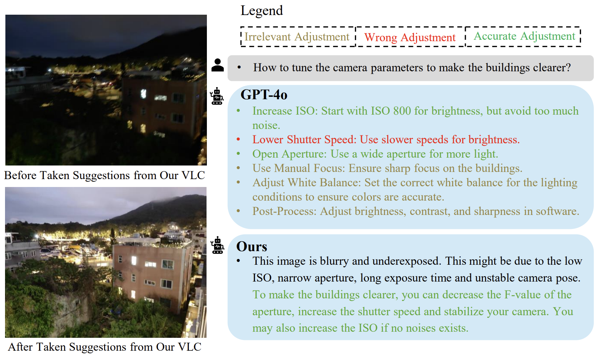

# Vision-Language-Camera: Aligning User Intent and Camera Expertise through Vision-Language Models



## Abstract
A professional photographer can align their requirements with the captured photos by manually adjusting camera settings. In contrast, the average user often relies on the auto-mode as a compromise, which can not meet their complex requirements. To address this, we propose the Vision-Language-Camera Model (VLC), which introduces the vision-language model to camera manual mode and offers guidance on how to adjust camera parameters tailored to the user's specific needs. To map the user requirements and visual information to camera parameters, we collect a large-scale visual question-answering dataset, CMM-QA, annotated with the idea of Chain-of-Thought (CoT). It includes conversations with diverse user requirements and precise camera parameter adjustments, spanning from distortion corrections to aesthetic considerations. The dataset comprises 89K visual question-answering pairs. By fine-tuning a pretrained vision-language model on the CMM-QA dataset, our VLC model is capable of producing accurate camera parameters that require adjustment, along with precise instructions on how to make these adjustments. The experiment results indicate that our method outperforms the state-of-the-art close-source vision-language model GPT-4o by 4.43% on the average precision of the suggested camera parameters and 6.40% on the accuracy of the descriptions of how to adjust the camera parameters. In real-world scenarios, users report that 97% of the photos they capture better align with their preferences after following the suggestions provided by our VLC. 

> **Vision-Language-Camera: Introducing Vision Language Models for Unleashing the Power of Camera Manual Mode** <br>Zian Qian, Zhili Chen, Mengxi Sun, Zhaoxiang Zhang, Qifeng Chen, Chenyang Lei<br>

[Paper]

This repository is an official implementation of "Vision-Language-Camera: Introducing Vision Language Models for Unleashing the Power of Camera Manual Mode" (VLC). This is the initial version of VLC, and this repo will be kept updated.

## Installation
#### 1. Clone VLC scripts

```shell
git clone https://github.com/zqianaa/VLC.git
```

#### 2. Install LLaVA.

```shell
git clone https://github.com/haotian-liu/LLaVA.git
cd LLaVA
conda create -n llava python=3.10 -y
conda activate llava
pip install --upgrade pip
pip install -e .
```

## Checkpoints

You can download our checkpoint from [VLC Checkpoint](https://drive.google.com/file/d/16oi5ISlCvPdr6-oi-0w_6YmLj6XUNzEG/view?usp=sharing) and put it into the checkpoints folder of LLaVA.


## CLI-Demo

You can test your own images based on the CLI Inference of LLaVA.

```shell
python -m llava.serve.cli \
--model-path ./checkpoints/llava-v1.5-7b-vlc-lora-v1 \
--model-base teowu/llava_v1.5_7b_qinstruct_preview_v0.1 \
--image-file "./imgs/img1.jpg"
```

## Inference

## Citation

## Contact
Feel free to contact me if there is any question. (Zian Qian, qwmqza@gmail.com)
